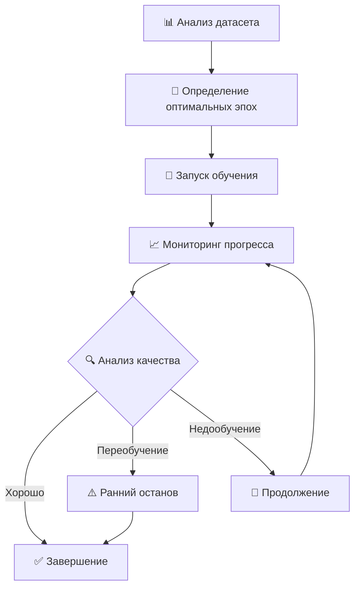

# 🧠 Интеллектуальная система обучения Smart Tuner V2

## 📊 Современные стандарты количества эпох для TTS

### 🔬 **Исследования 2024-2025 года показывают:**

| **Модель** | **Датасет** | **Эпохи** | **Качество** | **Время обучения** |
|------------|-------------|-----------|--------------|-------------------|
| **XTTS** | 1-5 часов | 10-30 | Отличное | 2-6 часов |
| **Tacotron2** | < 1 час | 3000-5000 | Хорошее | 12-24 часа |
| **Tacotron2** | 1-3 часа | 2000-3000 | Отличное | 8-16 часов |
| **Tacotron2** | 3-10 часов | 1000-2000 | Отличное | 6-12 часов |
| **Tacotron2** | > 10 часов | 500-1000 | Отличное | 4-8 часов |

### 🎯 **Оптимальные настройки нашей системы:**

```yaml
# Новые настройки в config.yaml
hyperparameter_search_space:
  epochs:
    min: 500          # Минимум для базового качества
    max: 5000         # Максимум для предотвращения переобучения  
    default: 2000     # Оптимальное значение для большинства случаев
```

## 🤖 Как работает интеллектуальная система

### 🔄 **Архитектура системы:**



### 📊 **Этапы анализа датасета:**

1. **Размер датасета:**
   - `very_small`: < 30 минут → 4000 эпох
   - `small`: 30 мин - 1 час → 3000 эпох  
   - `medium`: 1-3 часа → 2000 эпох
   - `large`: 3-10 часов → 1500 эпох
   - `very_large`: > 10 часов → 1000 эпох

2. **Качество аудио:**
   - `excellent` (>90%): -20% эпох
   - `good` (70-90%): -10% эпох
   - `fair` (50-70%): без изменений
   - `poor` (<50%): +30% эпох

3. **Сложность голоса:**
   - Акцент: +20% эпох
   - Эмоциональная речь: +30% эпох
   - Переменный темп: +20% эпох
   - Широкий диапазон pitch: +30% эпох

## 🚀 Использование новой системы

### 1️⃣ **Автоматический режим (рекомендуется):**

```bash
# Система сама определит оптимальные параметры
python smart_tuner_main.py --mode auto --trials 10
```

**Что происходит:**
- 📊 Анализ датасета (размер, качество, сложность)
- 🎯 Определение оптимального количества эпох
- 🔍 Оптимизация гиперпараметров (10 trials)
- 🚀 Обучение с лучшими параметрами
- 📈 Мониторинг прогресса в реальном времени

### 2️⃣ **Режим обучения с интеллектуальной оптимизацией:**

```bash
# Только обучение с автоматическим определением эпох
python smart_tuner_main.py --mode train --trials 1
```

**Особенности:**
- Система анализирует ваш датасет
- Определяет оптимальное количество эпох
- Запускает адаптивное обучение с мониторингом
- До 3 перезапусков при необходимости

### 3️⃣ **Ручное управление:**

```bash
# Задать количество эпох вручную
python smart_tuner_main.py --mode train --epochs 2500 --batch_size 32
```

### 4️⃣ **Только оптимизация параметров:**

```bash
# Найти лучшие гиперпараметры
python smart_tuner_main.py --mode optimize --trials 20
```

## 📈 Интеллектуальный мониторинг обучения

### 🔍 **Система обнаружения переобучения:**

```python
# Автоматически отслеживает:
overfitting_detection:
  val_loss_increase_threshold: 0.05    # 5% увеличение validation loss
  attention_degradation: True          # Ухудшение attention patterns
  gate_patterns: True                  # Проблемы с gate outputs
```

### ⚠️ **Признаки переобучения:**

1. **Validation loss растет** при падающем training loss
2. **Attention матрицы** теряют диагональность
3. **Gate outputs** показывают преждевременное закрытие
4. **Градиенты** становятся нестабильными

### 🛠️ **Автоматические исправления:**

- **Уменьшение learning rate** при нестабильности
- **Ранний останов** при переобучении
- **Перезапуск с другими параметрами** при проблемах
- **Адаптивная корректировка** batch size

## 📊 Фазовое обучение

### 🎯 **3 фазы интеллектуального обучения:**

#### **Фаза 1: Выравнивание Attention (0-500 эпох)**
```yaml
alignment_phase:
  patience: 100                    # Терпение к отсутствию улучшений
  min_improvement: 0.01           # Минимальное улучшение
  attention_threshold: 0.5        # Порог качества attention
```

**Цель:** Модель учится правильно выравнивать текст и аудио

#### **Фаза 2: Основное обучение (500-2000 эпох)**
```yaml
learning_phase:
  patience: 150
  min_improvement: 0.005
  attention_threshold: 0.8
```

**Цель:** Изучение мел-спектрограмм и основных паттернов речи

#### **Фаза 3: Тонкая настройка (2000+ эпох)**
```yaml
fine_tuning_phase:
  patience: 200
  min_improvement: 0.001
  attention_threshold: 0.9
```

**Цель:** Улучшение качества и естественности речи

## 🎛️ Адаптивные параметры

### 📈 **Динамическая корректировка Learning Rate:**

```python
# Автоматические стратегии:
lr_scheduling:
  scheduler_type: "cosine_annealing"
  warmup_epochs: 100              # Плавный старт
  min_lr_factor: 0.1              # Минимальная LR = 10% от начальной
```

### 🔄 **Адаптивный Batch Size:**

```python
batch_size_adaptation:
  increase_threshold: 0.95        # Увеличить при стабильном loss
  decrease_threshold: 2.0         # Уменьшить при больших градиентах
```

## 🚨 Система восстановления

### ⚡ **Обнаружение проблем:**

1. **Взрыв градиентов** (threshold: 10.0)
   - Действие: Уменьшение learning rate в 2 раза

2. **Плато loss** (patience: 100 эпох)
   - Действие: Перезапуск learning rate с warmup

3. **Коллапс attention** (threshold: 0.3)
   - Действие: Сброс весов attention и оптимизатора

### 🔧 **Стратегии восстановления:**

```python
recovery_strategies:
  reduce_lr:
    factor: 0.5                   # Уменьшить LR в 2 раза
    min_lr: 1e-7                  # Минимальная граница
    
  lr_restart:
    warmup_epochs: 50             # Плавный перезапуск
    peak_lr_factor: 2.0           # Пиковая LR в 2 раза больше
    
  attention_reset:
    reset_attention_weights: true  # Сброс весов attention
    reset_optimizer_state: true   # Сброс состояния оптимизатора
```

## 📊 Примеры работы системы

### 🎯 **Пример 1: Маленький датасет (30 минут)**

```bash
$ python smart_tuner_main.py --mode auto --trials 5

🧠 Smart Tuner V2 - Интеллектуальная система обучения TTS
============================================================
📊 Анализ датасета завершен:
   • Размер: very_small
   • Качество: good
   • Сложность: moderate
   • Рекомендуемые эпохи: 3200
   • Уверенность: 0.75
   • Обоснование: Рекомендация 3200 эпох основана на:
     • Размер датасета: very_small
     • Качество: good
     • Сложность голоса: moderate

🔍 Запуск интеллектуальной оптимизации...
   • Количество trials: 5
   • Базовые эпохи: 3200

🚀 Запуск интеллектуального обучения...
   • Режим: Адаптивное обучение с мониторингом качества
   • Максимальные эпохи: 3200
   • Уверенность в оценке: 0.75

📊 Эпоха 50 - Анализ прогресса:
   • Статус: not_converged
   • Риск переобучения: low
   • Продолжить обучение: Да

📊 Эпоха 100 - Анализ прогресса:
   • Статус: converging
   • Риск переобучения: low
   • Продолжить обучение: Да
   • Оставшиеся эпохи: ~3100

...

📊 Эпоха 2800 - Анализ прогресса:
   • Статус: converged
   • Риск переобучения: medium
   • Продолжить обучение: Нет
   • Рекомендация: Модель сошлась с хорошим качеством

✅ Smart Tuner завершил работу успешно!
```

### 🎯 **Пример 2: Большой датасет (8 часов)**

```bash
$ python smart_tuner_main.py --mode train --trials 1

📊 Анализ датасета завершен:
   • Размер: large
   • Качество: excellent
   • Сложность: simple
   • Рекомендуемые эпохи: 1200
   • Уверенность: 0.92
   • Обоснование: Рекомендация 1200 эпох основана на:
     • Размер датасета: large
     • Качество: excellent
     • Сложность голоса: simple

🚀 Запуск интеллектуального обучения...
   • Режим: Адаптивное обучение с мониторингом качества
   • Максимальные эпохи: 1200
   • Уверенность в оценке: 0.92

📊 Эпоха 50 - Анализ прогресса:
   • Статус: converging
   • Риск переобучения: low
   • Продолжить обучение: Да

...

📊 Эпоха 950 - Анализ прогресса:
   • Статус: converged
   • Риск переобучения: low
   • Продолжить обучение: Нет
   • Рекомендация: Модель сошлась с хорошим качеством

✅ Обучение завершено на 950 эпохе (экономия 250 эпох)!
```

## 🔧 Настройка системы

### ⚙️ **Конфигурация в config.yaml:**

```yaml
# Основные параметры
hyperparameter_search_space:
  epochs:
    min: 500
    max: 5000
    default: 2000

# Интеллектуальная система раннего останова
early_stopping:
  enabled: true
  patience_epochs: 200
  min_delta: 0.001
  
  adaptive_thresholds:
    enabled: true
    alignment_phase:
      patience: 100
      min_improvement: 0.01
    learning_phase:
      patience: 150
      min_improvement: 0.005
    fine_tuning_phase:
      patience: 200
      min_improvement: 0.001

# Система обнаружения переобучения
overfitting_detection:
  enabled: true
  val_loss_increase_threshold: 0.05
  attention_degradation:
    enabled: true
    min_diagonality: 0.7
  gate_patterns:
    enabled: true
    premature_stopping_threshold: 0.3

# Адаптивное обучение
adaptive_learning:
  enabled: true
  lr_scheduling:
    enabled: true
    scheduler_type: "cosine_annealing"
    warmup_epochs: 100
  batch_size_adaptation:
    enabled: true
    increase_threshold: 0.95
    decrease_threshold: 2.0

# Система восстановления
training_recovery:
  enabled: true
  problem_detection:
    gradient_explosion:
      threshold: 10.0
      action: "reduce_lr"
    loss_plateau:
      patience: 100
      action: "lr_restart"
    attention_collapse:
      threshold: 0.3
      action: "attention_reset"
```

## 📈 Мониторинг и логирование

### 📊 **Автоматические метрики:**

1. **Training метрики:** loss, grad_norm, learning_rate
2. **Validation метрики:** val_loss, attention_score, gate_accuracy
3. **Качественные метрики:** mel_quality, audio_naturalness
4. **Системные метрики:** memory_usage, training_speed

### 📝 **Логирование:**

- **MLflow:** Все метрики и параметры
- **TensorBoard:** Визуализация прогресса
- **База данных:** История оптимизации эпох
- **Файлы:** Детальные логи обучения

## 🎯 Рекомендации по использованию

### ✅ **Лучшие практики:**

1. **Используйте автоматический режим** для новых датасетов
2. **Доверьтесь интеллектуальной системе** - она основана на исследованиях
3. **Мониторьте прогресс каждые 50 эпох** для раннего обнаружения проблем
4. **Сохраняйте лучшие чекпоинты** автоматически
5. **Анализируйте результаты** через MLflow и TensorBoard

### ⚠️ **Что избегать:**

1. **Не задавайте слишком большое количество эпох** вручную
2. **Не игнорируйте предупреждения** о переобучении
3. **Не прерывайте обучение** без веских причин
4. **Не используйте одинаковые параметры** для разных датасетов

## 🔮 Будущие улучшения

### 🚀 **Планируемые функции:**

1. **Анализ эмоций** в датасете для более точной оценки сложности
2. **Автоматическое определение акцентов** через ASR модели
3. **Предсказание финального качества** на основе первых 100 эпох
4. **Рекомендации по улучшению датасета** (удаление плохих файлов)
5. **Интеграция с облачными сервисами** для распределенного обучения

### 📊 **Метрики качества:**

- **MOS (Mean Opinion Score)** автоматическая оценка
- **WER (Word Error Rate)** через ASR модели  
- **Naturalness Score** через специализированные модели
- **Speaker Similarity** для клонирования голоса

---

## 📞 Поддержка

Если у вас возникли вопросы или проблемы с интеллектуальной системой обучения, проверьте:

1. **Логи системы** в `smart_tuner.log`
2. **MLflow UI** для анализа метрик
3. **TensorBoard** для визуализации
4. **База данных оптимизации** в `smart_tuner/epoch_optimizer_history.db`

**Помните:** Интеллектуальная система учится на каждом запуске и становится точнее с опытом! 🧠✨ 