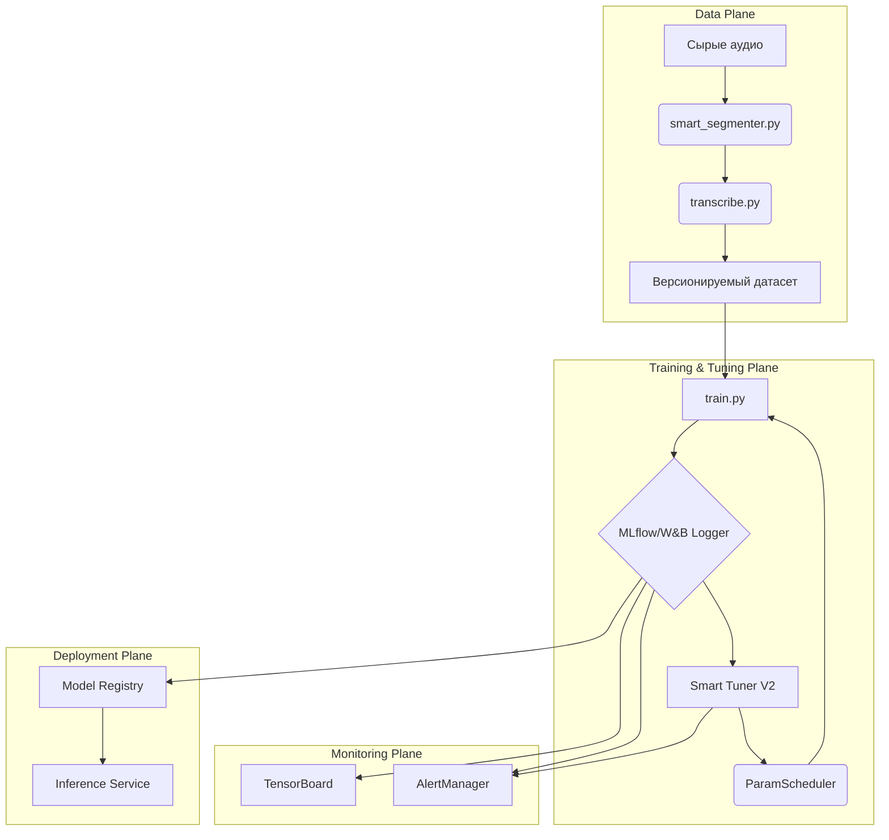

# Техническое Задание: Intelligent TTS Training Pipeline v2.0

> **Версия документа:** 2.0
> **Дата:** 20.06.2025
> **Статус:** Проект
>
> **Описание:** Этот документ является единым источником правды (Single Source of Truth) для проекта по созданию и внедрению автоматизированной MLOps-платформы для обучения TTS-моделей. Он объединяет, расширяет и заменяет все предыдущие спецификации (`TTS-Tech-Spec.md`, `enhanced-smart-tuner.md`, `1.md`, `2.md` и др.).

---

## 1. Концепция и цели

### 1.1. Бизнес-цель
Создать полностью автоматизированный конвейер, который позволяет быстро и с минимальными затратами человеческих ресурсов проводить эксперименты, обучать и выводить в production высококачественные модели синтеза речи (TTS).

### 1.2. Технические цели
1.  **Автоматизация полного цикла (End-to-End):** От подготовки данных до развертывания модели.
2.  **Интеллектуальный подбор гиперпараметров:** Внедрение системы "Smart Tuner", которая в реальном времени анализирует обучение и корректирует параметры для достижения лучшего качества.
3.  **Продвинутый контроль качества:** Реализация многофакторной системы ранней остановки (Early Stopping), которая предотвращает переобучение и экономит вычислительные ресурсы, основываясь не только на loss, но и на метриках качества аудио и внимания (attention).
4.  **Воспроизводимость и версионирование:** Гарантия того, что любой эксперимент, модель или набор данных могут быть точно воспроизведены.
5.  **Масштабируемость и эффективность:** Поддержка распределенного обучения и техник оптимизации использования GPU-памяти.

---

## 2. Архитектура и технологический стек

### 2.1. Высокоуровневая архитектура
Система строится на модульных принципах, где каждый компонент отвечает за свою часть MLOps-цикла.



### 2.2. Технологический стек
| Категория | Инструмент | Назначение | Статус |
| :--- | :--- | :--- | :--- |
| **Язык/Фреймворк** | Python 3.11+, PyTorch 2.0+ | Основа разработки | ✅ Используется |
| **Эксперименты** | MLflow | Трекинг, артефакты, модели | ✅ Используется |
| **Мониторинг** | TensorBoard | Визуализация метрик | ✅ Используется |
| **Мониторинг (Pro)** | Weights & Biases (W&B) | Расширенная визуализация | 🚀 **К внедрению** |
| **Оптимизация** | Optuna | Подбор гиперпараметров | 🚀 **К внедрению** |
| **Конфигурация** | Hydra | Управление конфигурациями | 💡 Рекомендуется |
| **Версионирование данных**| DVC (Data Version Control) | Контроль версий датасетов | 💡 Рекомендуется |
| **CI/CD** | GitHub Actions | Автоматизация тестов и сборок | ✅ Используется |

---

## 3. Подсистема «Smart Tuner V2»

Это ядро интеллектуальной автоматизации. Оно работает как внешний наблюдатель и управляющий процессом обучения.

### 3.1. Компоненты
| Компонент | Модуль (`smart_tuner/`) | Описание |
| :--- | :--- | :--- |
| **LogWatcher** | `log_watcher.py` | В реальном времени читает метрики из MLflow/TensorBoard. |
| **MetricsStore** | `metrics_store.py` | Агрегирует и хранит историю метрик для анализа. |
| **OptimizationEngine**| `opt_engine.py` | Реализует алгоритмы (Optuna: TPE, CMA-ES, HyperBand) для поиска лучших параметров. |
| **ParamScheduler** | `param_scheduler.py` | Формирует новую строку `--hparams` для перезапуска обучения. |
| **TrainerWrapper** | `trainer_wrapper.py` | Управляет жизненным циклом `train.py`: останавливает и перезапускает с новым чекпоинтом и параметрами. |
| **EarlyStopController**| `early_stop.py` | **Глобальный** контроллер ранней остановки. Принимает финальное решение на основе данных от всех модулей. |
| **AlertManager** | `alert_manager.py` | Отправляет уведомления в Telegram о ключевых событиях. |
| **ModelRegistry** | `registry.py` | Регистрирует лучшие версии моделей в MLflow Model Registry, хранит best_model.pt лучшую на данный момент модель/чекпоинт | 

### 3.2. Алгоритм работы
1.  **Инициализация:** Запускается главный скрипт `smart_tuner.py` с файлом конфигурации.
2.  **Наблюдение:** `LogWatcher` подписывается на родительский MLflow-run и начинает собирать метрики.
3.  **Анализ:** После накопления достаточного количества данных (`n_startup_trials`), `OptimizationEngine` предлагает новый, потенциально лучший набор гиперпараметров.
4.  **Перезапуск "на лету":**
    *   `TrainerWrapper` отправляет сигнал `SIGINT` процессу `train.py`, который корректно завершается, сохранив последний чекпоинт.
    *   `TrainerWrapper` немедленно перезапускает `train.py`, указывая путь к лучшему последнему чекпоинту (`--warm-start` или `--checkpoint_path`) и передавая новый набор гиперпараметров.
    *   В MLflow создается дочерний run для отслеживания этого "поколения" обучения.
5.  **Цикл:** Шаги 2-4 повторяются.
6.  **Завершение:** `EarlyStopController` останавливает весь процесс, когда выполняются глобальные критерии остановки (например, отсутствие улучшений в течение N циклов тюнинга).

---

## 4. Продвинутый контроль качества и Early Stopping

Этот модуль является частью `EarlyStopController` и использует многофакторный анализ для принятия решения об остановке.

### 4.1. Используемые техники
Ниже перечислены техники, которые будут интегрированы для предотвращения переобучения и точного определения момента остановки.

| Категория | Техника/Алгоритм | Применение к TTS |
| :--- | :--- | :--- |
| **Статистические методы**| CUSUM, Mann-Kendall Test | Детекция статистически значимых изменений и трендов в кривых обучения (loss, alignment). |
| **Байесовская оптимизация**| Gaussian Process Conv. | Прогнозирование точки конвергенции метрик на несколько эпох вперед. |
| **Анализ Внимания** | Alignment Monitoring | Отслеживание диагональности, монотонности и "здоровья" матрицы внимания. |
| **Регуляризация** | Spectral/Variational Dropout | Продвинутые техники Dropout, более подходящие для спектрограмм. |
| **Адаптивные методы**| Curriculum-Based Patience | "Терпение" (patience) меняется в зависимости от стадии обучения. |
| **Ensemble методы** | Weighted Voting | Конечное решение принимается на основе взвешенного "голосования" нескольких алгоритмов. |

### 4.2. Ключевые метрики для мониторинга
*   **Loss Metrics:** `val_loss`, `mel_loss`, `gate_loss`.
*   **Attention Metrics:** `attention_alignment_score` (диагональность), `attention_entropy`.
*   **Audio Quality Metrics (вычисляются на лету):** `Mel Cepstral Distortion (MCD)`, `PESQ`, `STOI`.
*   **Training Metrics:** `grad_norm`, `learning_rate`.

---

## 5. Единая конфигурация (`smart_tuner_config_v2.yaml`)

Этот файл будет управлять поведением всей системы. Он объединяет конфигурации из `enhanced-smart-tuner.md` и `advanced_early_stopping_config.yaml`.

```yaml
# ---------------------------------------------------
# Единая конфигурация для Smart Tuner V2 и подсистем
# ---------------------------------------------------

# 1. Основные параметры движка
core_engine:
  name: "SmartTunerV2"
  primary_engine: "optuna" # или "ray_tune"
  n_trials: 100 # Общее количество попыток тюнинга
  resume_from_checkpoint: true

# 2. Алгоритмы оптимизации
optimization:
  sampler: "tpe" # tpe, cma_es, bohb
  pruner: "hyperband"
  
  # Настройки для TPE
  tpe:
    n_startup_trials: 15
    consider_magic_clip: true
  
  # Настройки для Hyperband
  hyperband:
    min_resource: 1 # мин. эпох на trial
    max_resource: 80 # макс. эпох на trial
    reduction_factor: 3

# 3. Пространство поиска гиперпараметров
search_space:
  # Оптимизатор
  learning_rate: {type: "loguniform", low: 1e-5, high: 1e-2}
  weight_decay: {type: "loguniform", low: 1e-8, high: 1e-3}
  # Архитектура
  encoder_embedding_dim: {type: "choice", choices: [256, 512]}
  decoder_rnn_dim: {type: "choice", choices: [768, 1024]}
  dropout_decoder: {type: "uniform", low: 0.0, high: 0.5}
  # Обучение
  batch_size: {type: "choice", choices: [24, 32, 48]}
  grad_clip_thresh: {type: "uniform", low: 0.5, high: 1.5}
  # Параметры аудио
  mel_fmax: {type: "choice", choices: [7600, 8000, null]}

# 4. Продвинутый Early Stopping
smart_early_stopping:
  enabled: true
  # Веса для ансамбля
  ensemble_weights:
    statistical_consensus: 0.3
    bayesian_prediction: 0.4
    attention_analysis: 0.3
  
  # Глобальное терпение для всего тюнера (в циклах)
  tuner_patience: 5
  tuner_min_delta: 0.005 # Улучшение составной метрики
  
  # Настройки для анализа внимания
  attention_monitoring:
    enabled: true
    alignment_threshold: 0.8 # мин. диагональность
    monotonic_penalty: 0.1
  
  # Настройки для curriculum-based patience внутри одного trial
  adaptive_patience:
    enabled: true
    initial_patience: 5
    max_patience: 15
    stages:
      - {name: "warmup", epochs: 20, multiplier: 1.5}
      - {name: "main", epochs: 100, multiplier: 1.0}
      - {name: "fine_tune", epochs: 50, multiplier: 0.7}

# 5. Мониторинг и Алерты
monitoring:
  platforms:
    mlflow: {tracking_uri: "http://localhost:5000"}
    wandb: {project: "tacotron2-optimization", entity: "your-team"}
  alerts:
    slack_webhook: "${SLACK_WEBHOOK}" # из переменных окружения
    email_recipients: ["ml-team@example.com"]

# 6. Управление ресурсами и чекпоинтами
resources:
  mixed_precision: true
  gradient_checkpointing: true # для экономии памяти
  checkpointing:
    save_frequency_steps: 1000
    keep_n_checkpoints: 3

```

---

## 6. План внедрения (Дорожная карта)

| № | Этап | Ключевые задачи | Статус |
|:-:|:---|:---|:---:|
| 1 | **Базовая интеграция** | Создать структуру папок `smart_tuner/`. Реализовать `TrainerWrapper` для перезапуска `train.py` с чекпоинтов. | ⬜ |
| 2 | **Сбор метрик** | Реализовать `LogWatcher` и `MetricsStore`. Убедиться, что все необходимые метрики собираются и сохраняются. | ⬜ |
| 3 | **Движок оптимизации** | Интегрировать Optuna (`OptimizationEngine`). Настроить базовое пространство поиска (`search_space`) в YAML. | ⬜ |
| 4 | **Простой цикл тюнинга** | Соединить компоненты в первый рабочий цикл: `Watcher -> Store -> Engine -> Wrapper`. Провести первые 5-10 "поколений" тюнинга. | ⬜ |
| 5 | **Early Stopping: Level 1**| Внедрить базовый `EarlyStopController` (patience + min_delta) и `AlertManager` (уведомления). | ⬜ |
| 6 | **Early Stopping: Level 2**| Реализовать модули анализа внимания и статистических тестов (CUSUM, Mann-Kendall). | ⬜ |
| 7 | **Early Stopping: Level 3**| Внедрить ансамбль для принятия решений. Провести полное тестирование системы. | ⬜ |
| 8 | **CI/CD и Документация** | Написать тесты для всех компонентов тюнера. Обновить `README.md` и внутреннюю документацию. | ⬜ |

> **Легенда:** ⬜ — не начато, 🟡 — в процессе, ✅ — готово.

---

## 7. Журнал изменений документа
| Дата | Версия | Автор | Изменения |
| :--- | :--- | :--- | :--- |
| 20.06.2025 | 2.0 | AI Assistant | Создание единого ТЗ на основе всех предоставленных материалов. | 