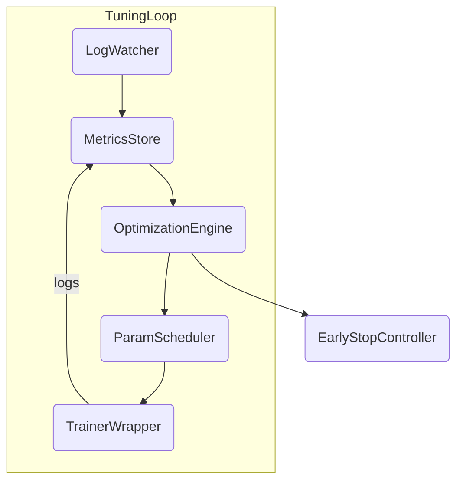

# TTS-Tech-Spec (v1.0)

> Документ объединяет базовые требования проекта «Intelligent TTS Training Pipeline» и расширенную подсистему `Smart Tuner V2`. Он служит единым источником правды (SSoT) для всей команды.

---

## 1. Общая информация
* **Модель**: Tacotron2 (+ возможные FastSpeech2/VITS в будущем)
* **Цель**: Автоматизированная система обучения TTS с умным автотюнингом гиперпараметров и строгим MLOps-контуром.
* **Язык кодовой базы**: Python ≥ 3.11, PEP 8, PyTorch ≥ 2.0.
* **Контроль версий данных/моделей**: MLflow + (позже DVC).
* **Мониторинг**: TensorBoard + (опция W&B).
* **CI/CD**: GitHub Actions + flake8 + pytest.

---

## 2. Базовые принципы разработки
1. Все изменения проходят через Pull Request.
2. Документация и комментарии — **на русском**.
3. Любой код должен проходить линтеры (`flake8`, `black`) и тесты.
4. Все процессы (сегментация, обучение, инференс) описываются скриптами из `install.sh`.

---

## 3. Структура репозитория (кратко)
| Директория | Назначение |
|------------|-----------|
| `data/` | Аудио, метки, подготовленные выборки |
| `output/` | Чекпоинты, логи MLflow/TensorBoard |
| `hifigan/` | Вокодер |
| `smart_tuner/` | (будет создано) исходники Smart Tuner V2 |

---

## 4. Пайплайн данных
1. Сырые WAV → `smart_segmenter.py` → сегменты.
2. Сегменты → `transcribe.py` → транскрипции.
3. Сбор `.csv` для `TextMelLoader`.
4. Хранение версий датасета через MLflow Artifact-Store (позже DVC).

---

## 5. Пайплайн обучения
1. Запуск `train.py` из `install.sh` (шаг 3).
2. Чекпоинт каждые `iters_per_checkpoint` итераций.
3. Логи:
   * TensorBoard (`output/<run>/tb/`)
   * MLflow (`mlruns/`)
4. Early Stopping (baseline) настроен в `train.py`.

---

## 6. Логирование и мониторинг
* **MLflow** — эксперименты, метрики, артефакты, модели.
* **TensorBoard** — визуализация спек-/аудио-метрик.
* **Prometheus + Grafana** *(backlog)* — системные метрики GPU/CPU.

---

## 7. Расширяемость модели
* Поддержка Tacotron2 + MMI, GST.
* TODO: добавить FastSpeech2, VITS как плагины (`model_zoo/`).

---

## 8. Требования к качеству кода
* PEP 8.
* Настройки `pyproject.toml`: black + isort.
* 95 % строк под тестами critical path (`pytest -q`).

---

## 9. Безопасность и лицензирование
* Шифрование артефактов MLflow.
* Хранение secret-token-ов через GitHub Secrets.
* Роли доступа (RBAC) для MLflow, Grafana.

---

## 10. Подсистема «Smart Tuner V2»

### 10.1 Цель
Автоматически улучшать гиперпараметры без сброса чекпоинтов, сохраняя историю логов, и останавливать процесс, когда достигнут максимум качества.

### 10.2 Основные компоненты
| Компонент | Файл/Модуль | Описание |
|-----------|------------|----------|
| **LogWatcher** | `smart_tuner/log_watcher.py` | Событийный парсер MLflow/TensorBoard. |
| **MetricsStore** | `smart_tuner/metrics_store.py` | Redis/SQLite-хранилище метрик. |
| **OptimizationEngine** | `smart_tuner/opt_engine.py` | Optuna + HyperBand + CMA-ES. |
| **ParamScheduler** | `smart_tuner/param_scheduler.py` | Генератор строки `--hparams`. |
| **TrainerWrapper** | `smart_tuner/trainer_wrapper.py` | CLI-обертка вокруг `train.py`. |
| **EarlyStopController** | `smart_tuner/early_stop.py` | Глобальный Early Stopping. |
| **AlertManager** | `smart_tuner/alert_manager.py` | Slack/Email алерты. |

### 10.3 Диаграмма


### 10.4 Конфигурация `smart_tuner.yaml`
```yaml
search_algorithm: optuna
n_trials: 50
resume_from_checkpoint: true
search_space:
  learning_rate: {type: loguniform, low: 1e-5, high: 1e-3}
  weight_decay:  {type: loguniform, low: 1e-6, high: 1e-3}
  dropout_decoder: {type: uniform, low: 0.0, high: 0.5}
```

### 10.5 Алгоритм работы
1. **Старт**: `smart_tuner.py --config smart_tuner.yaml`.
2. **LogWatcher** подписывается на MLflow run `<parent>`.
3. После `n_startup_iters` получает первые метрики.
4. **OptimizationEngine** предлагает новый набор гиперпараметров.
5. **TrainerWrapper**:
   * останавливает текущий `train.py` (SIGINT),
   * перезапускает его с `--checkpoint_path last.ckpt --hparams <новые>`.
6. Цикл продолжается, пока **EarlyStopController** не решит «стоп».

### 10.6 Критерии остановки
* `val_loss` не улучшился > `min_delta` в `patience` подряд тюнинг-итераций.
* Минимальный `learning_rate` достиг `1e-6`.
* `max_runtime_hours`.

### 10.7 Выходные артефакты
* `best_model.ckpt` в MLflow.
* `tuning_history.json` (весь путь).

---

## 11. Дорожная карта
| № | Период | Milestone | Статус |
|---|--------|-----------|--------|
| 1 | 24 июн → 30 июн | Проектирование Smart Tuner V2 (архитектура, YAML) | ⬜ |
| 2 | 01 июл → 07 июл | Реализация LogWatcher + MetricsStore | ⬜ |
| 3 | 08 июл → 14 июл | Интеграция OptimizationEngine (Optuna) | ⬜ |
| 4 | 15 июл → 21 июл | TrainerWrapper, перезапуск чекпоинтов | ⬜ |
| 5 | 22 июл → 28 июл | EarlyStopController + AlertManager | ⬜ |
| 6 | 29 июл → 04 авг | CI, тесты, доки | ⬜ |

Легенда: ⬜ — не начато, 🟡 — в процессе, ✅ — готово.

---

## 12. Журнал выполнения
| Дата | Версия | Изменения |
|------|--------|-----------|
| 20-06-25 | 1.0.0 | Создан объединённый `TTS-Tech-Spec.md` с Smart Tuner V2. |

---

> После каждого коммита обновляйте таблицы 11 и 12, чтобы отражать прогресс. 