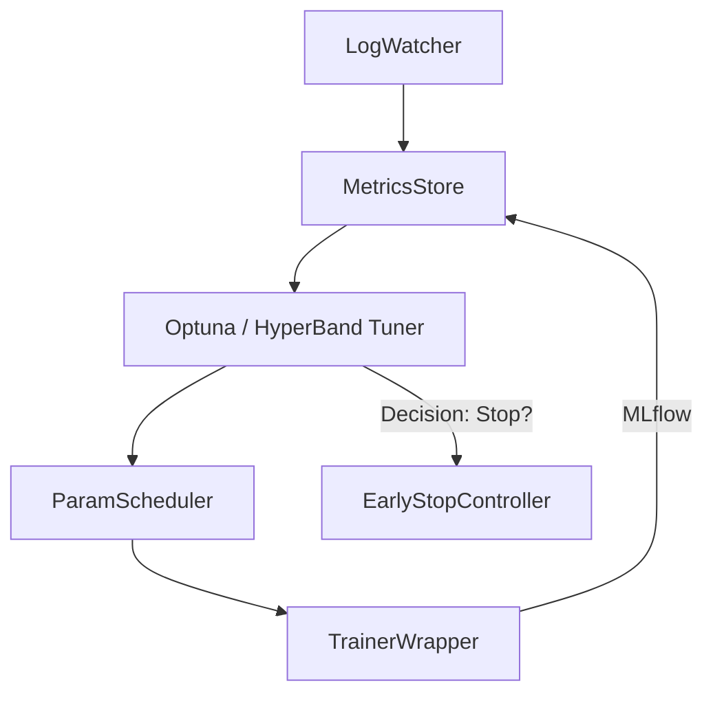

# TTS-Tech-Spec

## 11. Подсистема «Умный автотюнинг гиперпараметров»

### 11.1 Цель
Разработать автономную подсистему, которая:
1. Анализирует логи и метрики обучения (MLflow + TensorBoard). 
2. Рекоммендует и применяет улучшенные гиперпараметры *без* обнуления чекпоинтов.
3. Перезапускает обучение «на лету», продолжая с последнего чекпоинта.
4. Отслеживает улучшения, сохраняя целостность истории логов.
5. Автоматически определяет момент окончания обучения (достигнут плато / критерий превосходства).

### 11.2 Основные требования
* Язык реализации – **Python 3.11**.
* Совместимость с текущим скриптом `train.py` и MLflow.
* Поддержка распределённого обучения (DDP) без деградации производительности.
* Безопасная работа с GPU-ресурсами: не превышать `n_gpus`, заданные пользователем.
* Логи **не очищаются**; новые эксперименты логируются как MLflow *child runs*.
* Подсистема должна хранить собственный YAML-файл «состояние тюнера» для воспроизводимости.

### 11.3 Архитектура

* **LogWatcher** – читает MLflow/TensorBoard события в realtime.
* **MetricsStore** – агрегирует показатели, предоставляет API tuner-у.
* **Tuner** – алгоритмы BO, TPE, HyperBand; выбирает новый набор гиперпараметров.
* **ParamScheduler** – формирует `--hparams` строку и пересоздаёт *child run*.
* **TrainerWrapper** – запускает/перезапускает `train.py` с `--checkpoint_path`.
* **EarlyStopController** – завершает всю процедуру, когда улучшение < `min_delta` на `patience` итераций.

### 11.4 Потоки данных
1. `train.py` ➜ MLflow ➜ LogWatcher.
2. LogWatcher + MetricsStore ➜ Tuner: *history → suggest(params).*  
3. ParamScheduler + TrainerWrapper → новый запуск.

### 11.5 Алгоритмы выбора гиперпараметров
| Категория | Параметры | Диапазон | Алгоритм |
|-----------|-----------|----------|----------|
| Оптимизация | learning_rate | log-uniform 1e-5–1e-3 | TPE |
| Архитектура | dropout_decoder | 0.0–0.5 | Random + SHA |
| Regularization | weight_decay | 1e-6–1e-3 | BOHB |
| Curriculum | teacher_forcing_decay | 0–50 k ит. | Grid |

### 11.6 Критерии остановки
* `val_loss` не улучшается > `min_delta=0.002` в течение `patience=4` тюнинг-итераций.
* Достигнут лимит времени `max_hours_per_run` или GPU-квоты.

### 11.7 Файл конфигурации `smart_tuner.yaml`
```yaml
search_algorithm: optuna
n_startup_trials: 10
n_trials: 50
resume_from_checkpoint: true
search_space:
  learning_rate: {type: loguniform, low: 1e-5, high: 1e-3}
  dropout_decoder: {type: uniform, low: 0.0, high: 0.5}
```

## 12. Дорожная карта (обновлено)
| Итерация | Период | Задачи | Ответственный |
|----------|--------|--------|---------------|
| 12.1 | 24 июн → 30 июн | Проектирование архитектуры тюнера, выбор Optuna | AI команда |
| 12.2 | 01 июл → 07 июл | Прототип LogWatcher + MetricsStore | AI команда |
| 12.3 | 08 июл → 14 июл | Интеграция TrainerWrapper, запуск первых 5 child-runs | AI команда |
| 12.4 | 15 июл → 21 июл | Добавить EarlyStopController, финальное тестирование | AI команда |
| 12.5 | 22 июл → 28 июл | Документация, CI, метрики качества | AI команда |

## 13. Журнал выполнения
| Дата | Версия | Изменение |
|------|--------|-----------|
| 20.06.25 | 0.7.0 | Добавлена секция 11. Подсистема «Умный автотюнинг гиперпараметров». Обновлена дорожная карта. |

---

> **TODO**: после утверждения ТЗ создать задачи в GitHub-Projects и настроить CI шаг `pytest && flake8` для всех новых модулей. 


Техническое задание: Автоматизированная система обучения Tacotron2

Проанализировав существующее техническое задание и современные тренды в области MLOps, я представляю комплексное решение для автоматизации обучения модели Tacotron2 с применением передовых практик машинного обучения

.
Анализ текущего ТЗ и области для улучшений

Существующая система "Умный автотюнинг гиперпараметров" имеет хорошую базовую архитектуру, но требует значительного расширения для соответствия современным стандартам MLOps
. Основные недостатки текущего подхода включают ограниченный набор алгоритмов оптимизации, отсутствие интеграции с облачными платформами мониторинга и недостаточное внимание к специфике TTS-моделей

.
Архитектура MLOps системы для автоматизированного обучения Tacotron2
Архитектура MLOps системы для автоматизированного обучения Tacotron2

Современные требования к автоматизированным системам обучения включают полную интеграцию с экосистемой MLOps, поддержку распределенного обучения, автоматическое масштабирование ресурсов и интеллектуальные системы мониторинга качества

.
Рекомендуемый технологический стек
Основные компоненты (Tier 1 - Обязательные)

Базовую архитектуру должны составлять проверенные открытые решения с отличной интеграцией с PyTorch
. MLflow выступает в роли центрального хранилища экспериментов, обеспечивая версионирование моделей и воспроизводимость результатов . Optuna предоставляет современные алгоритмы байесовской оптимизации, включая TPE и CMA-ES, специально адаптированные для нейронных сетей . TensorBoard обеспечивает визуализацию процесса обучения и анализ audio-специфичных метрик

.
Дополнительные инструменты (Tier 2 - Рекомендуемые)

Для расширенного мониторинга рекомендуется Weights & Biases с его передовыми возможностями отслеживания экспериментов и коллаборации
. Ray Tune добавляет масштабируемость для параллельной оптимизации гиперпараметров . DVC обеспечивает версионирование данных и пайплайнов . GitHub Actions автоматизирует CI/CD процессы

.
mlops_tools_comparison.csv
Сгенерированный файл
Специализированные TTS инструменты

Для работы с аудио используются librosa и soundfile для обработки аудиосигналов
. Hydra управляет конфигурациями и экспериментами . Система мониторинга включает Prometheus и Grafana для отслеживания системных метрик

.
Архитектура расширенной системы
Ядро системы автотюнинга

Центральная система включает восемь взаимосвязанных компонентов
. LogWatcher в реальном времени анализирует логи MLflow и TensorBoard, используя потоковую обработку для минимизации задержек . MetricsStore агрегирует метрики качества, включая специфичные для TTS показатели как MOS, PESQ и STOI

.

OptimizationEngine реализует множественные алгоритмы оптимизации
. Tree-structured Parzen Estimator (TPE) обеспечивает эффективный поиск в пространстве гиперпараметров . HyperBand автоматически распределяет вычислительные ресурсы между экспериментами . CMA-ES особенно эффективен для непрерывных параметров архитектуры

.
Временная диаграмма процесса автоматизированного обучения Tacotron2
Временная диаграмма процесса автоматизированного обучения Tacotron2
Интеллектуальное управление ресурсами

Система поддерживает распределенное обучение через PyTorch DDP для масштабирования на несколько GPU
. Gradient checkpointing снижает потребление памяти до 50% без значительного снижения скорости . Mixed precision обучение ускоряет процесс и экономит память

.
Мониторинг и контроль качества

Многоуровневая система мониторинга отслеживает пять категорий метрик
. Loss Metrics составляют 30% от общего мониторинга и включают Mel Loss, Gate Loss и PostNet Loss . Audio Quality метрики (25%) измеряют перцептуальное качество синтезированной речи . Training Metrics (20%) контролируют стабильность обучения

.
Распределение метрик мониторинга для системы автоматизированного обучения Tacotron2
Распределение метрик мониторинга для системы автоматизированного обучения Tacotron2
Расширенная конфигурация системы

Детальная конфигурация включает 10 основных блоков настроек, охватывающих все аспекты автоматизированного обучения
. Пространство поиска расширено до включения архитектурных параметров Tacotron2, таких как размер эмбеддингов энкодера, размерность RNN декодера и аудио-специфичные параметры

.
enhanced-smart-tuner.md
Сгенерированный файл
Интеграция с облачными платформами

Система поддерживает множественные платформы мониторинга
. MLflow обеспечивает базовое отслеживание экспериментов . Weights & Biases добавляет расширенную визуализацию и коллаборацию . Neptune.ai предоставляет enterprise-уровень мониторинга

.
Система алертов и уведомлений

Интегрированная система уведомлений поддерживает Slack, Discord и email каналы
. Алерты настраиваются на основе пороговых значений метрик качества, включая детекцию плато в обучении и критические ошибки системы

.
Специфика для Tacotron2
Архитектурные особенности

Система учитывает специфику архитектуры Tacotron2, включая оптимизацию attention механизмов и alignment качества
. Пространство поиска включает параметры mel-spectrogram обработки, такие как n_fft, hop_length и количество mel-фильтров

.
Качество аудио

Автоматическая оценка качества синтезированной речи включает объективные метрики PESQ, STOI и субъективные оценки через MOS
. Система автоматически генерирует тестовые образцы и сравнивает их с baseline моделями

.
Современные альтернативы

Система готова к интеграции с современными TTS архитектурами, включая FastSpeech2 и VITS
. Модульная архитектура позволяет легко адаптировать систему для различных TTS моделей

.
План внедрения и временные рамки

Реализация системы разделена на четыре основных этапа, каждый продолжительностью 1-2 недели
. Первый этап включает создание базовой архитектуры и интеграцию с MLflow . Второй этап добавляет алгоритмы оптимизации и систему мониторинга . Третий этап интегрирует распределенное обучение и облачные платформы . Финальный этап включает тестирование, документацию и CI/CD интеграцию

.
Безопасность и соответствие стандартам

Система включает современные практики безопасности, включая управление секретами через HashiCorp Vault, RBAC контроль доступа и аудит логирование
. Поддержка GDPR включает анонимизацию логов и шифрование артефактов

.
Заключение

Предлагаемая система представляет собой комплексное решение для автоматизации обучения Tacotron2, интегрирующее лучшие практики современного MLOps
. Модульная архитектура обеспечивает масштабируемость и адаптируемость, в то время как интеграция с проверенными инструментами гарантирует надежность и производительность . Система готова к промышленному внедрению и может значительно ускорить процесс разработки и оптимизации TTS моделей .


# Расширенная конфигурация Smart Tuner для Tacotron2

## Архитектурные компоненты

### 1. Core Engine (Ядро системы)
```yaml
core_engine:
  name: "SmartTunerV2"
  version: "2.0.0"
  language: "python"
  python_version: ">=3.11"
  framework: "pytorch"
  
  components:
    - log_watcher
    - metrics_store
    - optimization_engine
    - param_scheduler
    - trainer_wrapper
    - early_stop_controller
    - alert_manager
    - model_registry
```

### 2. Optimization Algorithms (Алгоритмы оптимизации)
```yaml
optimization:
  primary_engine: "optuna"
  secondary_engines:
    - "ray_tune"
    - "hyperopt"
  
  algorithms:
    tpe:
      name: "Tree-structured Parzen Estimator"
      startup_trials: 15
      consider_magic_clip: true
    
    cma_es:
      name: "Covariance Matrix Adaptation"
      sigma0: 0.3
      
    bohb:
      name: "Bayesian Optimization HyperBand"
      min_budget: 10
      max_budget: 100
    
    hyperband:
      name: "HyperBand Scheduler"
      max_iter: 80
      eta: 3
```

### 3. Search Space Definition (Пространство поиска)
```yaml
search_space:
  # Optimizer parameters
  learning_rate:
    type: "loguniform"
    low: 1e-5
    high: 1e-2
    default: 1e-3
    
  weight_decay:
    type: "loguniform"
    low: 1e-8
    high: 1e-2
    default: 1e-6
    
  # Architecture parameters
  encoder_embedding_dim:
    type: "choice"
    choices: [256, 512, 768]
    default: 512
    
  decoder_rnn_dim:
    type: "choice"
    choices: [512, 768, 1024]
    default: 1024
    
  dropout_decoder:
    type: "uniform"
    low: 0.0
    high: 0.6
    default: 0.1
    
  # Training parameters
  batch_size:
    type: "choice"
    choices: [16, 24, 32, 48]
    default: 32
    
  grad_clip_thresh:
    type: "uniform"
    low: 0.5
    high: 2.0
    default: 1.0
    
  # Audio parameters
  mel_fmin:
    type: "uniform"
    low: 0.0
    high: 50.0
    default: 0.0
    
  mel_fmax:
    type: "choice"
    choices: [7600, 8000, 11025]
    default: 8000
```

### 4. Monitoring & Alerting (Мониторинг и уведомления)
```yaml
monitoring:
  platforms:
    mlflow:
      tracking_uri: "http://localhost:5000"
      experiment_name: "tacotron2_autotuning"
      auto_log: true
      
    wandb:
      project: "tacotron2-optimization"
      entity: "your-team"
      sync_tensorboard: true
      
    tensorboard:
      log_dir: "./logs/tensorboard"
      write_graph: true
      write_images: true
      
    neptune:
      project: "workspace/tacotron2"
      api_token: "${NEPTUNE_API_TOKEN}"
      
  metrics:
    primary: "val_loss"
    secondary:
      - "train_loss"
      - "mel_loss"
      - "gate_loss"
      - "alignment_score"
      - "audio_quality_score"
      
  alerts:
    slack:
      webhook_url: "${SLACK_WEBHOOK}"
      channels: ["#ml-alerts", "#tacotron-team"]
      
    discord:
      webhook_url: "${DISCORD_WEBHOOK}"
      
    email:
      smtp_server: "smtp.gmail.com"
      recipients: ["ml-team@company.com"]
```

### 5. Early Stopping & Quality Control (Ранняя остановка)
```yaml
early_stopping:
  strategies:
    patience_based:
      patience: 6
      min_delta: 0.001
      mode: "min"
      restore_best_weights: true
      
    plateau_detection:
      factor: 0.5
      patience: 4
      threshold: 0.0001
      cooldown: 2
      
    improvement_threshold:
      min_improvement_percent: 0.5
      evaluation_window: 10
      
  quality_gates:
    min_alignment_score: 0.85
    max_acceptable_loss: 2.0
    audio_quality_threshold: 3.5
```

### 6. Resource Management (Управление ресурсами)
```yaml
resources:
  gpu:
    max_gpus: 4
    memory_fraction: 0.9
    allow_growth: true
    mixed_precision: true
    
  distributed:
    backend: "nccl"
    world_size: 4
    rank: 0
    
  checkpointing:
    save_frequency: 1000  # steps
    keep_n_checkpoints: 5
    async_save: true
    compression: "gzip"
    
  memory_optimization:
    gradient_checkpointing: true
    activation_checkpointing: true
    cpu_offload: false
```

### 7. Audio Processing Pipeline (Обработка аудио)
```yaml
audio_processing:
  preprocessing:
    sample_rate: 22050
    n_fft: 1024
    hop_length: 256
    win_length: 1024
    n_mels: 80
    
  augmentation:
    enable: true
    techniques:
      - "time_stretch"
      - "pitch_shift"
      - "add_noise"
      - "speed_perturbation"
    
  quality_metrics:
    - "mel_spectral_distance"
    - "perceptual_evaluation_speech_quality"
    - "short_time_objective_intelligibility"
```

### 8. Experiment Tracking (Отслеживание экспериментов)
```yaml
experiment_tracking:
  versioning:
    model_registry: "mlflow"
    artifact_store: "s3://ml-artifacts"
    
  metadata:
    track_code_version: true
    track_environment: true
    track_dependencies: true
    track_system_metrics: true
    
  reproducibility:
    seed: 42
    deterministic: true
    benchmark_mode: false
```

### 9. CI/CD Integration (Интеграция CI/CD)
```yaml
cicd:
  triggers:
    on_push: true
    on_pull_request: true
    scheduled: "0 2 * * *"  # Daily at 2 AM
    
  quality_checks:
    - "pytest"
    - "flake8"
    - "mypy"
    - "black"
    - "audio_unit_tests"
    
  deployment:
    staging_threshold: 0.95  # accuracy
    production_threshold: 0.97
    rollback_trigger: 0.9
```

### 10. Security & Compliance (Безопасность)
```yaml
security:
  secrets_management:
    provider: "vault"
    auto_rotate: true
    
  access_control:
    rbac_enabled: true
    audit_logging: true
    
  data_privacy:
    anonymize_logs: true
    encrypt_artifacts: true
    gdpr_compliant: true
```

## Пример использования

```bash
# Запуск автоматизированного обучения
python smart_tuner.py \
  --config enhanced-smart-tuner.yaml \
  --dataset path/to/tacotron2/dataset \
  --max-trials 100 \
  --timeout 24h \
  --auto-deploy-best
```